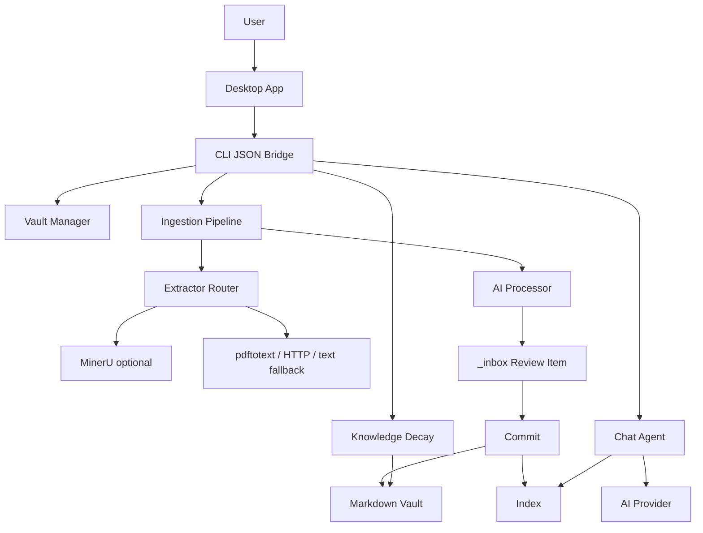

# Lexicon Architecture

## System Shape

Lexicon is a local-first, agent-oriented knowledge app. The durable source of
truth is the vault folder, not the app database. The standalone desktop app owns
the user workflow, while transient metadata, indexes, and provider configuration
live under `~/.lexicon`.

## Core Data Flow

1. User submits a source through the desktop app or CLI.
2. Extractor router selects URL, text, PDF, or MinerU adapter.
3. Extracted Markdown goes to the AI processor with `agent.md` as system prompt.
4. The processor writes a review item into `_inbox`.
5. Human approval moves the note into `concepts`, `guidelines`, or `references`.
6. `_index.md` and local search index are rebuilt.
7. Chat retrieves matching notes and calls the configured AI provider.

## Desktop Boundary

The Python package is the core engine. The desktop app should treat it as a
local subprocess/service boundary and consume `--json` output for:

- Vault registry and health: `settings`, `doctor`, `init-vault`.
- Ingestion review: `ingest`, `inbox --json`, `inbox --show --json`.
- Commit/reject actions: `inbox --approve`, `inbox --reject`.
- Retrieval and answer generation: `scan`, `chat --json`.
- Staleness workflow: `decay --json`.

Obsidian is not the primary UI architecture. It remains a compatibility target
because Lexicon stores durable knowledge as Markdown files.

## Design Constraints

- `agent.md` is the domain contract for a vault.
- Provider/model config is app-level.
- Human review is mandatory before durable commit.
- Optional heavy integrations must not block basic local usage.
